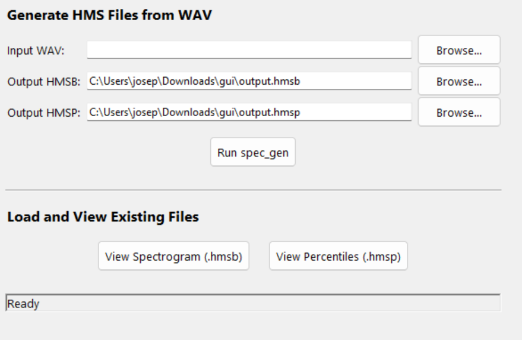

## Set up on Windows x64

This has been tested on Windows 11. Windows 10 should work. Older versions might not be reliable. 

### Download / `git clone`

Either run `git clone` via command line or powershell: 

```powershell
> git clone https://github.com/josephross004/pluspam
```

or just download: navigate to https://github.com/josephross004/pluspam and click the blue "Code" button at the top, then click "Download ZIP". Go into your Windows File Explorer and click "Extract All" at the top to unzip the folder. 

### The Program Files

Go into the `pluspam` folder, then, go into `dist` and then `win64`. This is where the executable is. 

Then you can choose your preference. If you'd prefer a command line interface (CLI), see [CLI](#CLI), otherwise, continue reading.

### GUI (Graphical User Interface)

Double click on `gui.exe` (or if you're still in Powershell, type `./gui.exe`). If you get a warning from Windows SmartScreen, click 'more info' and then 'run anyway'. 

To generate HMSP and HMSB from wav file: select a wav file using the first 'browse' option, then, click 'run spec_gen'. 

To view HMSP and HMSB, select a file using the View Spectrogram and View Percentiles buttons.

(only new HMSP files, old files generated through the old MicroPyPam will need to be rendered in that environment.) 

### CLI

In Powershell or CMD, you can use `spec_gen.exe` the same as the Linux `spec_gen`. 

As of the current version, `batch_process` does not work. 